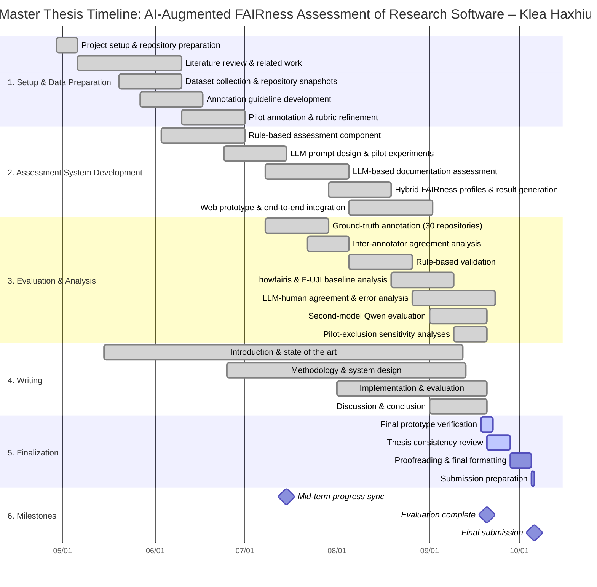

```mermaid
gantt
    title Master Thesis Timeline: AI-Augmented FAIRness Assessment of Research Software – Klea Haxhiu
    dateFormat YYYY-MM-DD
    axisFormat %m/%d

    section 1. Setup & Data Preparation
    Project setup & repository preparation        :done, t1, 2026-04-29, 7d
    Literature review & related work              :done, t2, 2026-05-06, 35d
    Dataset collection & repository snapshots     :done, t3, 2026-05-20, 21d
    Annotation guideline development              :done, t4, 2026-05-27, 21d
    Pilot annotation & rubric refinement          :done, t5, 2026-06-10, 21d

    section 2. Assessment System Development
    Rule-based assessment component               :done, t6, 2026-06-03, 28d
    LLM prompt design & pilot experiments         :done, t7, 2026-06-24, 21d
    LLM-based documentation assessment            :done, t8, 2026-07-08, 28d
    Hybrid FAIRness profiles & result generation  :done, t9, 2026-07-29, 21d
    Web prototype & end-to-end integration        :done, t10, 2026-08-05, 28d

    section 3. Evaluation & Analysis
    Ground-truth annotation (30 repositories)     :done, t11, 2026-07-08, 21d
    Inter-annotator agreement analysis            :done, t12, 2026-07-22, 14d
    Rule-based validation                         :done, t13, 2026-08-05, 21d
    howfairis & F-UJI baseline analysis           :done, t14, 2026-08-19, 21d
    LLM-human agreement & error analysis          :done, t15, 2026-08-26, 28d
    Second-model Qwen evaluation                  :done, t16, 2026-09-01, 19d
    Pilot-exclusion sensitivity analyses          :done, t17, 2026-09-09, 11d

    section 4. Writing
    Introduction & state of the art               :done, t18, 2026-05-15, 120d
    Methodology & system design                   :done, t19, 2026-06-25, 80d
    Implementation & evaluation                   :done, t20, 2026-08-01, 50d
    Discussion & conclusion                       :done, t21, 2026-09-01, 19d

    section 5. Finalization
    Final prototype verification                  :active, t22, 2026-09-18, 4d
    Thesis consistency review                     :active, t23, 2026-09-20, 8d
    Proofreading & final formatting               :t24, 2026-09-28, 7d
    Submission preparation                        :t25, 2026-10-05, 1d

    section 6. Milestones
    Mid-term progress sync                        :milestone, m1, 2026-07-15, 0d
    Evaluation complete                           :milestone, m2, 2026-09-20, 0d
    Final submission                              :milestone, m3, 2026-10-06, 0d
```
 